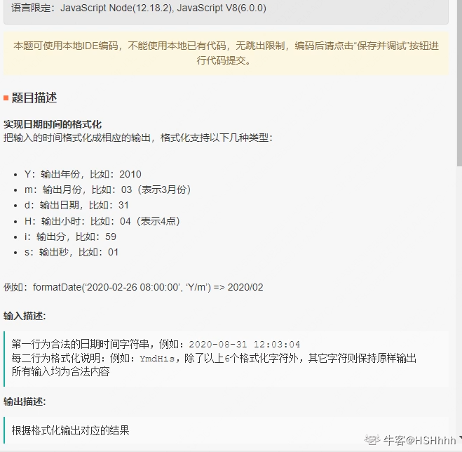
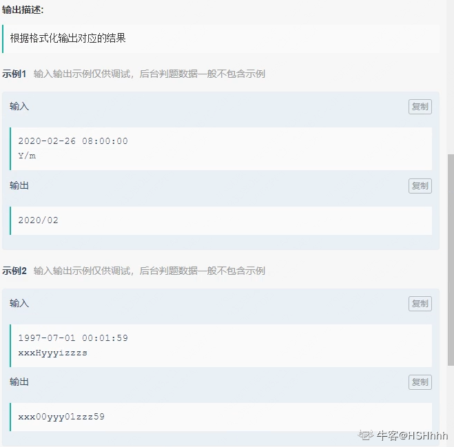
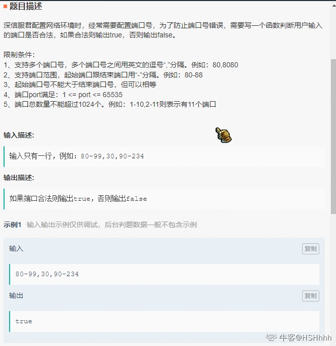
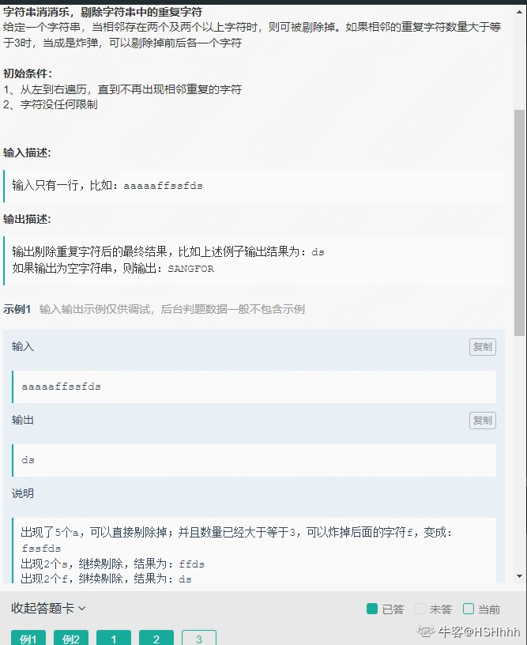

- 
- 
- 
- 算法题

```js
 const uls = [url, url, ...];
//实现一个函数 实现串行发送请求
//种方式
//1. 递归
//2. 迭代
```

- 算法
```js
// 将 arr = ['2018-1-1', '2018-1-5', '2019-6-5', '2019-7-5', '2020-4-1', '2020-4-3'] 转化为：
obj = {
    '2018-1':['2018-1-1', '2018-1-5'],
    '2019-6':['2019-6-5'],
    '2019-7':['2019-7-5'],
    '2020-4':['2020-4-1', '2020-4-3']
}
```